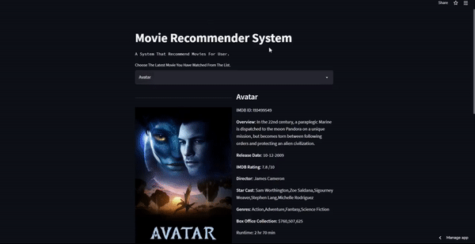
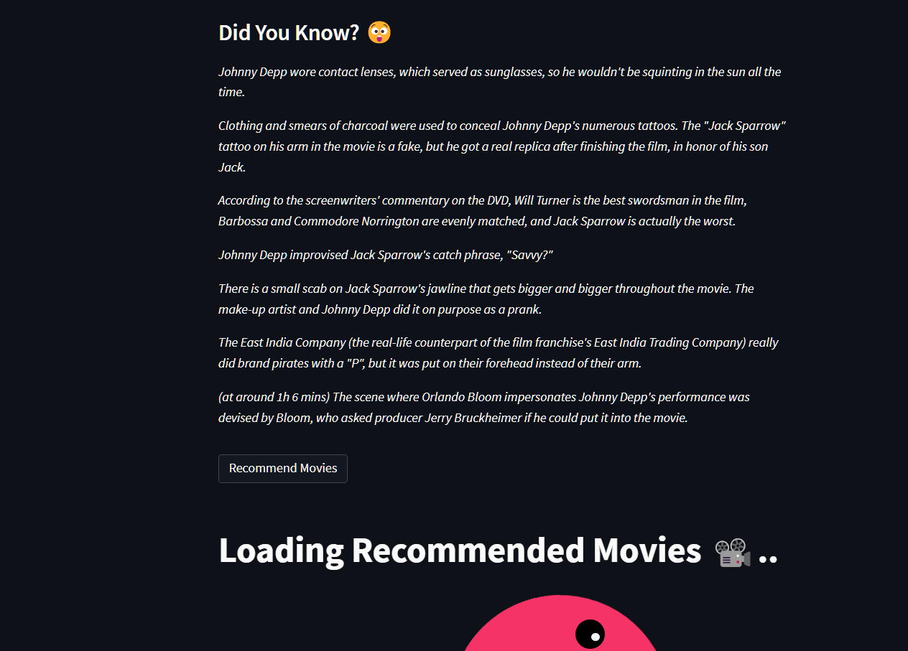
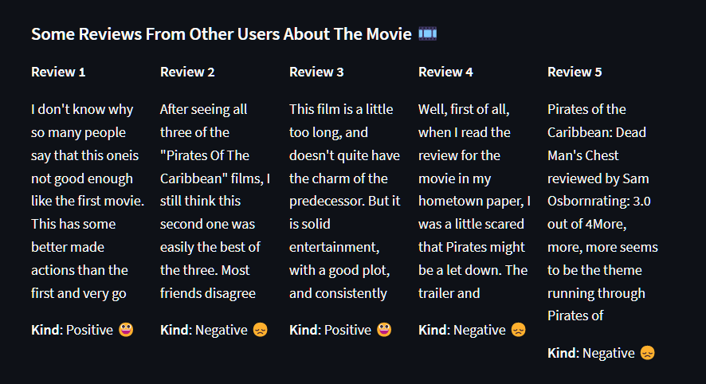

# MOVIE RECOMMENDER SYSTEM WITH SENTIMENT ANALYSIS

 
 ### Find your next movie with us.
 

### Features
- Recommends movies based on user last watched movie.
- Generate sentiment analysis on recommended movies reviews.
- Gives Verdict about liking of movie based on other users reviews.
- Return releated information about movie like cast member, movie budget, director, and a small overview.
- Top 5 reviews with their predicted sentiments.
- Recommends 10 movies for user to watch with most likable on top and least on bottom.

[Try it Now](https://share.streamlit.io/abhayparashar31/movie_recommender_system_with_sentiment_analysis/main/app.py)

### Images

## Contributing

Contributions are always welcome!!!!

**Developed By** [@abhayparashar31](https://github.com/Abhayparashar31)
