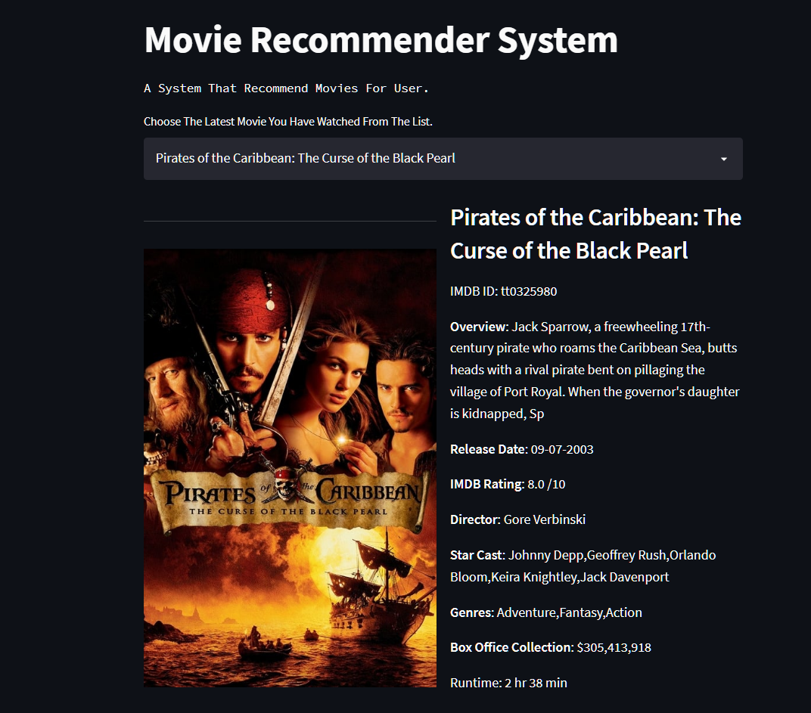

# MOVIE RECOMMENDER SYSTEM WITH SENTIMENT ANALYSIS

 
 ### Find your next movie with us.
 

### Features
- Recommends movies based on user last watched movie.
- Generate sentiment analysis on recommended movies reviews.
- Gives Verdict about liking of movie based on other users reviews.
- Return releated information about movie like cast member, movie budget, director, and a small overview.
- Top 5 reviews with their predicted sentiments.
- Recommends 10 movies for user to watch with most likable on top and least on bottom.

[Try it Now](https://share.streamlit.io/abhayparashar31/movie_recommender_system_with_sentiment_analysis/main/app.py)

### Images

## Contributing

Contributions are always welcome!!!!

**Developed By** [@abhayparashar31](https://github.com/Abhayparashar31)

--- 
➡ **Application Update Details**

Date | Info | 
------------ | -------------
20 June 2022 | Added New Fonts, Gifs, and Changed Look of webpage
02 June 2022 | Solved The Issue of Empty List Whenever APIs Doesn't have data for the movie.
25 May  2022 | Added `Did You Know` Feature For The Web App Contaning Interesting Facts About Movies Using Web Scraping. 
20 Apr  2022 | Build a NLP Model in IMDB 50k Dataset To Perform Sentiment Analysis On Movie Reviews.
12 Apr  2022 | Scraped Recommended Movies Reviews To Showcase Top Reviews On The Web Page. 
25 Mar  2022 | Used Cleaned Data To Recommende Movies Using Cosine Similarity.
24 Mar  2022 | Collected Movies Data From Kaggle, Cleaned It, Performed Analysis To Get More Insights From It.
